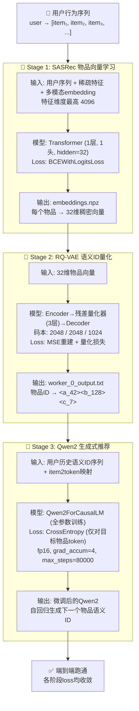
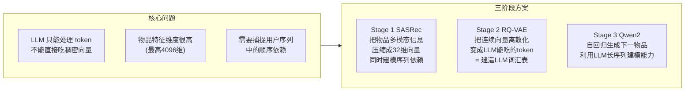
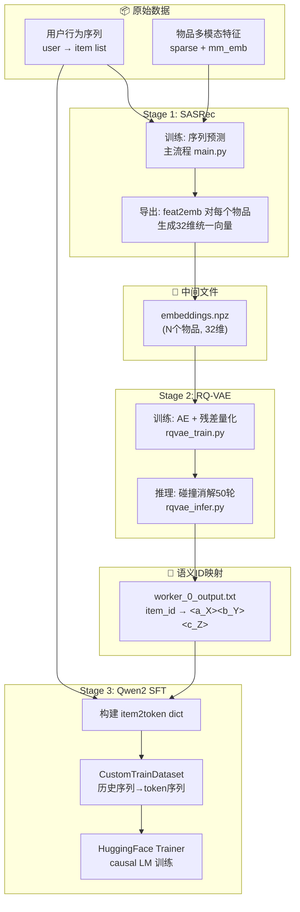
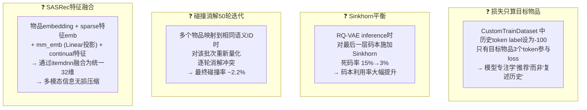
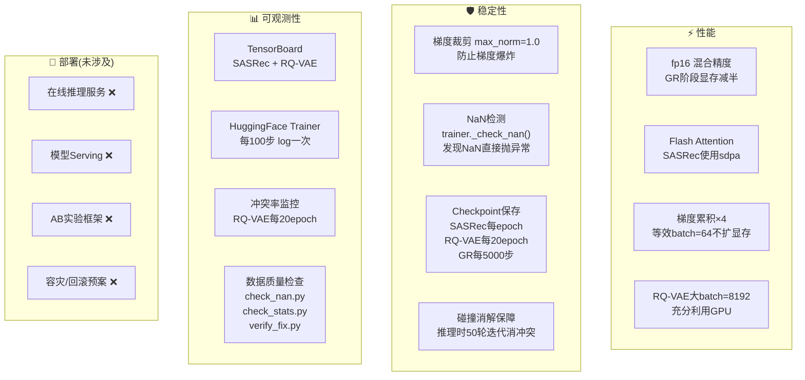

# 生成式推荐系统 (TIGER) —— 三层架构图

> GitHub 原生渲染 Mermaid 图表，直接打开即可查看

---

## 一、功能层：三阶段生成式推荐链路



---

## 二、系统层：模块设计与交互

### 2.1 为什么分成三阶段？



### 2.2 为什么选 RQ-VAE（残差量化）而不是普通 VQ？

| 方案 | 表达能力 | 冲突率 | 缺点 |
|---|---|---|---|
| 普通 VQ (1层码本) | 单层 2048 | 高，大量物品碰撞 | 一个 token 区分度不够 |
| 单层大码本 (20万+) | 单层 20万 | 一般 | 码本太大训练不稳定 |
| **RQ-VAE (3层残差)** ✅ | 2048×2048×1024 ≈ 43亿组合 | **~2.2%** | 稍复杂 |
| 哈希 | 无法反向传播 | — | 不可学习 |

### 2.3 为什么选 Qwen2 而不是其他 LLM？

| 方案 | 是否考虑 | 选择理由 |
|---|---|---|
| Qwen2 ✅ | 最终选择 | 中文推荐场景，Qwen系列对中文友好；架构标准，HuggingFace 生态完善 |
| LLaMA | 备选 | 主要面向英文，中文推荐场景欠佳 |
| GPT-2 | 备选 | 模型太老，长序列建模能力弱 |
| 从头训 Transformer | 备选 | SASRec已经做了小Transformer，LLM需要更大容量 |

### 2.4 数据流与模块交互



### 2.5 关键设计决策



---

## 三、工程层：性能·稳定性·可观测性



---

## 附：关键指标速查

| 阶段 | 指标 | 数值 |
|---|---|---|
| SASRec | 训练 Loss | 1.8 → 1.2 |
| SASRec | 验证 Loss | ~1.2 (稳定) |
| RQ-VAE | 重建 MSE | ~0.06 |
| RQ-VAE | **冲突率** | **~2.2%** |
| RQ-VAE | 死码率(无Sinkhorn) | 15% |
| RQ-VAE | 死码率(有Sinkhorn) | <3% |
| Qwen2 SFT | 训练 Loss | 2.9 → 1.5 |
| Qwen2 SFT | 梯度范数 | ~1.7 (稳定) |

---

## 附：文件结构速查

```
llm4rec/
├── sasrec/           # Stage 1: 序列推荐 → 物品向量
│   ├── main.py       #   训练入口 + embed导出
│   ├── model.py      #   SASRec Transformer 模型
│   └── dataset.py    #   多模态特征数据加载
├── rqvae/            # Stage 2: 向量 → 语义ID
│   ├── train/        #   训练: Encoder + RQ + Decoder
│   │   ├── rqvae_train.py
│   │   ├── rqvae_model.py
│   │   └── trainer.py
│   └── infer/        #   推理: 碰撞消解 + 输出映射表
│       ├── rqvae_infer.py
│       └── rqvae_model.py
├── gr/               # Stage 3: LLM 生成式推荐
│   ├── train_gr.py   #   HuggingFace Trainer 主流程
│   ├── custom_dataset.py  # Token化数据集
│   ├── utils.py      #   模型加载
│   └── gr_train.json #   训练配置
├── data/             # 原始数据
├── check_nan.py      # 数据质量检查
├── check_stats.py
└── verify_fix.py
```
