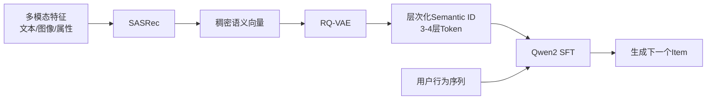

# LLM-Enhanced Generative Recommender with Semantic ID

> 基于语义ID与大语言模型的端到端生成式推荐系统
> 腾讯广告大赛项目

## 项目背景

传统ID-based推荐系统存在两个核心问题：
- **数据稀疏性**：长尾物品交互数据不足，模型难以学习有效表征
- **冷启动**：新物品缺乏历史交互，无法获得有意义的ID Embedding

本项目设计并实现了一套基于 **Semantic ID** 的端到端生成式推荐架构，
将 LLM 的语义理解与推理能力引入推荐系统，从根本上解决稀疏性问题。

## 系统架构



## 核心模块

### Step 1｜多模态表征学习（sasrec/）
- 构建基于 **SASRec** 的序列化表征模块
- 融合 Item 的文本、图像、属性等多模态信息，生成高维稠密向量
- 有效捕捉 Item 间细粒度语义关联，解决传统 ID Embedding 冷启动问题

### Step 2｜层次化语义 ID 构建（rqvae/）
- 引入 **RQ-VAE（Residual Quantized VAE）** 进行向量量化
- 将 Item 稠密向量映射为 3 层深度的**层次化 Semantic ID**
- 构建紧凑 Codebook，将海量商品压缩至有限 Token 空间
- 使 LLM 能够直接处理推荐数据，无需专用 ID Embedding 表

### Step 3｜生成式预训练与微调（gr/）
- 基于 **Qwen2** 底座模型搭建生成式推荐 Pipeline
- 设计流式数据加载器（IterableDataset），将用户历史交互转化为 Semantic ID 序列
- 采用 **Next Item Prediction** 任务进行生成式预测
- 使用 **DeepSpeed** 分布式训练优化，支持大规模数据训练(ing阶段)

## 技术栈
| 模块 | 技术 |
|------|------|
| 序列建模 | SASRec, Transformer |
| 向量量化 | RQ-VAE |
| 生成模型 | Qwen2 |
| 框架 | Python, PyTorch |

## 快速开始

```bash
# Step 1: 多模态表征学习
cd sasrec && python train.py

# Step 2: 构建语义 ID
cd rqvae && python train.py

# Step 3: 生成式推荐微调
cd gr && python train.py
```

## 参考
- [TIGER: Recommender Systems with Generative Retrieval](https://arxiv.org/abs/2305.05065)
- [microsoft/RecAI](https://github.com/microsoft/RecAI)

